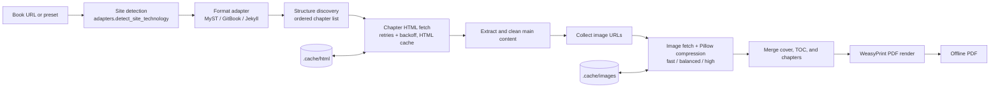

# GetMyTextbook

> A Python web-scraping and PDF-automation pipeline that converts structured online textbooks into one offline PDF.

[](#quick-start)
[](LICENSE)

GetMyTextbook extracts documentation-style course content, preserves its chapter structure, cleans it for print, and renders a single offline PDF. It supports **MyST**, **GitBook**, and **Jekyll** textbook sites, with built-in presets for UC Berkeley's `ds100` (Data C100) and `cs61b` (CS 61B) course materials.

### What this demonstrates for a Data Engineer

- **Heterogeneous ingestion** — one adapter interface for MyST, GitBook, and Jekyll with format-specific discovery (book-root, sequential links, site nav) and explicit unsupported-format failure.
- **Ordered structure discovery** — each adapter builds a deterministic chapter list so the export keeps the real reading order instead of crawling arbitrarily.
- **Resilient fetching** — `HttpClient` reuses a `requests.Session`, retries with backoff on 429 and timeouts, and caches HTML in a SHA-256-addressed local cache for fast repeat runs.
- **Data cleaning & rendering** — article extraction, HTML normalization, Pillow image compression (fast/balanced/high), and data-URI embedding before WeasyPrint produces a deterministic PDF.
- **Drift validation** — `ds100 --validate` re-discovers the live TOC and diffs it against a recorded snapshot, reporting missing/extra chapters and order drift with a non-zero exit on change.

---

## Why I built this

Course notes are usually optimized for browser navigation, not for offline reading or archival as one coherent document. I built GetMyTextbook to treat that conversion as a small **document-engineering pipeline** rather than a one-off browser save: identify a supported site format, discover its structure, fetch and normalize chapter content, optimize images, then produce a print-ready PDF.

The project deliberately targets structured textbook platforms. That constraint makes chapter ordering, content selection, and rendering behavior explicit — instead of pretending that every webpage can be exported reliably.

---

## Supported sources

| Source | How it is handled |
| --- | --- |
| `ds100` preset | MyST-based Data C100 course notes (Berkeley) |
| `cs61b` preset | GitBook-based CS 61B textbook |
| Custom MyST URL | Format detection + book-root structure discovery |
| Custom GitBook URL | Format detection + sequential chapter discovery |
| Custom Jekyll URL | Format detection + site-navigation discovery |

Each successful run writes one PDF to `output/` by default. `--debug-html` can also save the merged HTML used before PDF rendering.

---

## Pipeline architecture



Orchestration lives in `services.py`: it resolves an adapter, discovers chapters, fetches chapter payloads, replaces images with compressed data URIs, builds the full HTML, and calls the PDF renderer. `scraper.py` keeps cache-aware HTTP fetching with retry/backoff; `image_handler.py` maintains a separate image cache keyed by URL and compression profile.

---

## Engineering highlights

- **Adapter-driven format detection.** `adapters.py` identifies MyST, GitBook, or Jekyll signals (e.g. the HTML `<meta name="generator">` tag) and routes custom URLs to a format-specific adapter.
- **Layered structure discovery.** Each adapter builds an ordered chapter list from the live site — book-root navigation for MyST, sequential links for GitBook, site navigation for Jekyll — so exports keep the real reading order.
- **Cache-aware, resilient fetching.** `HttpClient` reuses a `requests.Session`, applies configurable timeouts and retries, backs off on rate limits (HTTP 429), and caches HTML pages in a SHA-256-addressed local cache (`cache_store.py`) so repeat runs are fast.
- **Image-aware document rendering.** Pillow applies `fast`, `balanced`, or `high` compression profiles, keeps alpha images as PNG, converts where applicable, and embeds the compressed results as data URIs before WeasyPrint renders the final PDF.
- **Deterministic DS100 validation.** `python3 app.py ds100 --validate` re-discovers the live table of contents and compares it against the adapter's recorded snapshot, reporting missing chapters, extra chapters, title mismatches, and ordering drift — with a non-zero exit status when differences are found.

---

## Quick start

```bash
git clone https://github.com/JeremyL691/GetMyTextbook.git
cd GetMyTextbook
python3 -m venv .venv && source .venv/bin/activate
pip install -r requirements.txt
```

> **macOS note:** WeasyPrint needs a few Homebrew libraries, e.g. `pango` and `glib`.

```bash
# Export the Data C100 book (MyST preset, cached)
python3 app.py ds100

# Export the CS 61B book (GitBook preset)
python3 app.py cs61b

# Export any supported textbook site
python3 app.py custom --url https://example.com/book/

# Validate the live DS100 TOC against the recorded snapshot
python3 app.py ds100 --validate
```

Interactive mode (`python3 app.py`) also offers a menu of all presets and options.

### Useful options

| Flag | What it does |
| --- | --- |
| `--output PATH` | Where to write the final PDF |
| `--debug-html` | Save the merged HTML before PDF rendering |
| `--image-profile fast\|balanced\|high` | Image compression profile |
| `--refresh` | Force-refresh cached preset content |
| `--validate` | Deterministic TOC drift check (`ds100` only) |
| `--skip-frontmatter` | Omit frontmatter pages where supported |

Custom URL mode always refreshes chapter HTML so it pulls the latest live content; built-in presets use the cache by default for fast repeat runs.

---

## Repository map

| Module | Responsibility |
| --- | --- |
| `app.py` | Interactive menu, CLI entry points, `--validate` wiring |
| `main.py` / `main_pdf.py` | Thin process entry points |
| `services.py` | Orchestration: adapter resolution, discovery, extraction, merge, validation |
| `adapters.py` | Site-technology detection + MyST / GitBook adapter logic |
| `jekyll_adapter.py` | Jekyll-specific adapter |
| `scraper.py` | HTTP client: session reuse, retries, backoff, HTML cache |
| `html_builder.py` | HTML merging and cleanup for print |
| `image_handler.py` | Image fetch, Pillow compression profiles, data-URI embedding |
| `pdf_renderer.py` | WeasyPrint PDF generation |
| `cache_store.py` | SHA-256-addressed HTML / image caches |
| `config.py` | Defaults and tuning knobs |
| `models.py` | Request / option / report models |

---

## Limitations

GetMyTextbook is built for **structured documentation platforms** (MyST, GitBook, Jekyll). Arbitrary websites and paywalled content are intentionally out of scope — if the site format isn't detected, the tool stops with a clear error instead of producing a broken export.

## License

MIT — see [LICENSE](LICENSE).