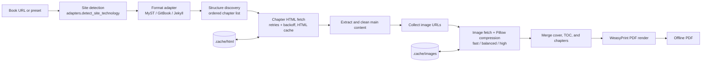

# GetMyTextbook

A small Python tool I wrote to turn online course textbooks into a single offline PDF.

[](#quick-start)
[](LICENSE)

It started with Data C100: the notes live on a MyST site, and I wanted one clean PDF I could read offline and keep after the semester ended. The tool detects the site format, walks the book structure, fetches and cleans every chapter, compresses the images, and renders a single PDF. MyST, GitBook, and Jekyll sites work out of the box, with presets for Berkeley's `ds100` and `cs61b` course materials.

There is no magic here. The interesting parts are that chapter order comes from the actual site navigation instead of a crawl, fetching survives rate limits with retries and backoff, and a `--validate` flag re-reads the live table of contents and diffs it against a recorded snapshot, so you notice when the course site quietly rearranges itself.

---

## Why I built this

Most course notes are built for browser navigation, not for reading offline or archiving as one coherent document. I could have saved each page manually, but that gets you a folder of HTML files, not a book. I wanted the conversion to behave like a small pipeline: identify the format, discover the structure, fetch and normalize the content, optimize the images, and hand a print-ready PDF to WeasyPrint.

The tool deliberately only handles structured documentation platforms. That constraint keeps chapter ordering, content selection, and rendering explicit. A random website or a paywalled page is out of scope and fails with a clear error instead of producing a broken export.

---

## Supported sources

| Source | What happens |
| --- | --- |
| `ds100` preset | MyST-based Data C100 course notes (Berkeley) |
| `cs61b` preset | GitBook-based CS 61B textbook |
| Custom MyST URL | Format detection + book-root structure discovery |
| Custom GitBook URL | Format detection + sequential chapter discovery |
| Custom Jekyll URL | Format detection + site-navigation discovery |

Every successful run writes one PDF to `output/` by default. Use `--debug-html` if you want the merged HTML before rendering.

---

## How it works



`services.py` is the orchestrator: it resolves an adapter, discovers chapters, fetches the payloads, swaps images for compressed data URIs, builds the full HTML, and calls the renderer. `scraper.py` owns cache-aware HTTP fetching with retry and backoff, and `image_handler.py` keeps a separate image cache keyed by URL and compression profile.

A few details worth knowing:

- **Format detection** looks for concrete signals, e.g. the `<meta name="generator">` tag, and routes custom URLs to the right adapter. Unknown formats fail loudly.
- **Ordered discovery** is per-adapter: book-root navigation for MyST, sequential links for GitBook, site navigation for Jekyll. The export follows the reading order, not crawl order.
- **Fetching** keeps one `requests.Session` in an `HttpClient` with configurable timeouts, retries with backoff on 429 responses and timeouts, and caches HTML pages in a SHA-256-addressed local cache so repeat runs are fast.
- **Images** go through Pillow with `fast`, `balanced`, and `high` compression profiles, keep alpha as PNG, and get embedded as data URIs before WeasyPrint renders.
- **Validation** (`ds100 --validate`) re-discovers the live TOC and compares it against the recorded snapshot: missing chapters, extra chapters, title mismatches, and ordering drift all get reported, and the exit code turns non-zero when something changed.

---

## Quick start

```bash
git clone https://github.com/JeremyL691/GetMyTextbook.git
cd GetMyTextbook
python3 -m venv .venv && source .venv/bin/activate
pip install -r requirements.txt
```

> **macOS note:** WeasyPrint needs a couple of Homebrew libraries, e.g. `pango` and `glib`.

```bash
# Export the Data C100 book (MyST preset, cached)
python3 app.py ds100

# Export the CS 61B book (GitBook preset)
python3 app.py cs61b

# Export any supported textbook site
python3 app.py custom --url https://example.com/book/

# Validate the live DS100 TOC against the recorded snapshot
python3 app.py ds100 --validate
```

Without arguments (`python3 app.py`) it opens an interactive menu with all presets and options.

Useful flags: `--output PATH` chooses the destination, `--debug-html` saves the merged HTML, `--image-profile fast|balanced|high` picks the compression profile, `--refresh` forces a refresh of cached presets, `--validate` runs the TOC drift check (ds100 only), and `--skip-frontmatter` omits frontmatter pages where supported. Custom URL mode always refreshes chapter HTML; built-in presets use the cache by default.

---

## Repository layout

```text
app.py              interactive menu, CLI entry points, --validate wiring
main.py, main_pdf.py  thin process entry points
services.py         orchestration: adapter resolution, discovery, extraction, merge, validation
adapters.py         site-technology detection + MyST / GitBook adapter logic
jekyll_adapter.py   Jekyll-specific adapter
scraper.py          HTTP client: session reuse, retries, backoff, HTML cache
html_builder.py     HTML merging and cleanup for print
image_handler.py    image fetch, Pillow compression profiles, data-URI embedding
pdf_renderer.py     WeasyPrint PDF generation
cache_store.py      SHA-256-addressed HTML / image caches
config.py           defaults and tuning knobs
models.py           request / option / report models
```

## License

MIT. See [LICENSE](LICENSE).